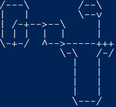

# Advent of Code 2018 solutions
This repository contains my solutions for the [Advent of Code 2018](http://adventofcode.com/), written in Rust.



## Compiling and running a solution
To compile and run a solution, you can use Cargo:

```bash
cargo run --bin december01
```
